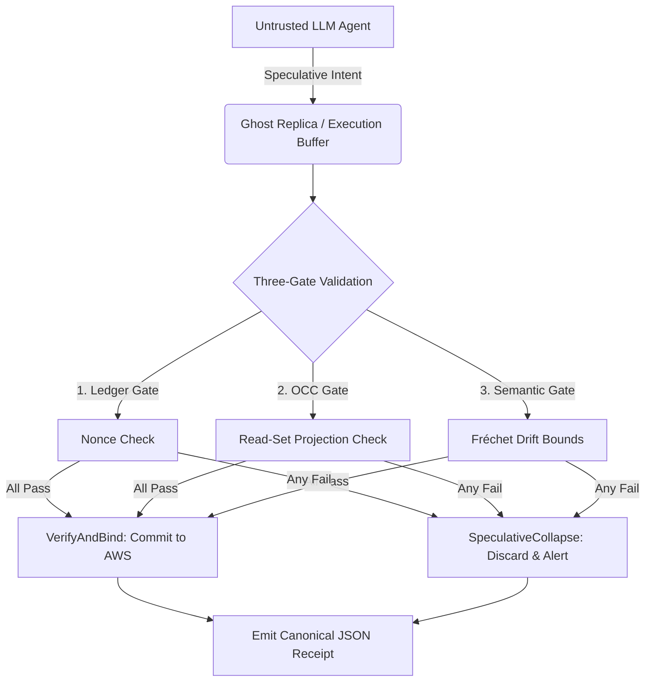

# Ghost-Ark: A Provenance-Kernel Verifier for AI Governance Receipts

**The research claim, in one sentence.** A governance receipt identifies an execution only up to the *kernel* of its canonicalizer — the set of distinct inputs that the canonicalizer maps to the same digest — and because that kernel is fixed while the set of downstream consumers keeps growing, **receipt soundness does not persist over time even when nothing about the receipt system changes.**

Ghost-Ark is the executable demonstration of that claim. It ships the verifier, the adversarial corpora, the formal models, and the measurement harness needed to check it — including real unintended kernel members found in Ghost-Ark's *own* canonicalizer.

- **The problem statement:** [docs/research/PROVENANCE_KERNEL_PROBLEM.md](./docs/research/PROVENANCE_KERNEL_PROBLEM.md)
- **The one-page thesis, evidence map, and falsification conditions:** [docs/research/00_THESIS.md](./docs/research/00_THESIS.md)
- **The pre-registered experiments and their measured results:** [docs/research/EXPERIMENTS.md](./docs/research/EXPERIMENTS.md)

**What this is not.** Not a proof that any model, output, or deployment is safe, aligned, compliant, or correct. Not post-quantum secure. Not production-hardened. Ghost-Ark evaluates the *identifiability structure* of evidence, never the meaning of what the evidence describes. Every non-claim is mechanically enforced — see [Claim Discipline](#claim-discipline--reviewer-interpretation).

**Two instruments serve the claim, and neither is the claim itself:** an AWS-native evidence/receipt control plane (`packages/`, `services/`, `infra/`), and the DAB speculative-execution gateway (`dab/`). Where each is only local, only synthesized, or unbuilt is stated in [docs/artifact/CI_COVERAGE.md](./docs/artifact/CI_COVERAGE.md).

---

# Verify a Receipt in 60 Seconds

Ghost-Ark's narrowest useful demo is local receipt verification. Given a sample receipt, a public key, and an expected tenant, the verifier checks:

- Canonical receipt identity
- Canonical payload digest
- Tenant expectation
- RSA-PSS signature validity

```bash
npm ci

npm run ghost-verify -- \
  --receipt examples/sample-receipts/valid-receipt.json \
  --key examples/sample-receipts/public-key.pem \
  --tenant acme-lab
```

Tampering with the receipt payload, tenant, digest, algorithm, or signature changes the verdict to **FAIL**.

This verifier executes entirely locally against the supplied public key.

---

# Verify the Research Claim in 5 Minutes

The receipt demo above shows the machinery works. These four experiments are the actual
research contribution — each prints measured results, its own coverage boundary, and its
non-claim.

```bash
npm run experiments
```

| | Experiment | What it measures |
|:--|:---|:---|
| **E1** | Provenance kernel census | 31 pre-registered pathology classes × 5 independent canonicalizer pipelines. Finds **5 unintended kernel members in Ghost-Ark's own canonicalizer** (0 under strict admission), and shows the kernel is set by the *parser*, not the canonicalizer. |
| **E2** | Verification cost | p50 with IQR against a declared baseline on a recorded host. Asymmetric verification is 65.89× the parse baseline. |
| **E3** | Adversarial corpus detection | 30 fixtures through the real verifier, stratified by who rejects. **26/26 verifier-intrinsic**, 3/3 controls pass, 2 documented boundaries excluded from the rate. |
| **E4** | Metamorphic guard | Forces each verifier check to pass and re-runs the corpus. Proves the detections in E3 are **not tautological**. |

Measured numbers, findings, coverage boundaries, and a written list of **retracted prior
claims**: [docs/research/EXPERIMENTS.md](./docs/research/EXPERIMENTS.md).

---

# Architecture — the DAB instrument

The diagram below is the **DAB speculative-execution gateway** (`dab/`), one of the two
instruments serving the thesis. It is not the thesis, and it is not the AWS evidence plane
described under [Core Planes](#core-planes).



---

## Start Here — Reading Map

- **What is the contribution, and what would refute it?** → [docs/research/00_THESIS.md](./docs/research/00_THESIS.md) (one page)
- **Want the part that is useful without Ghost-Ark?** → [kernel-probe](./docs/research/KERNEL_PROBE.md). Point it at *your* canonicalizer and it reports which real distinctions that canonicalizer destroys: `npm run kernel-probe -- --command "jq -S -c ."`. No receipt, no AWS, no trust in this project required.
- **Reviewing this adversarially?** → [Reviewer Attack Sheet](./docs/artifact/REVIEWER_ATTACK_SHEET.md) — the ten sharpest questions against this work, answered with commands, including the unflattering ones
- **Which of the 40 research documents matter?** → [RESEARCH_INDEX.json](./docs/research/RESEARCH_INDEX.json) classifies every one as core / supporting / exploratory / process / non-research. Seven are core; 23 supporting, 5 exploratory, 5 process.
- **What is NOT established?** → [Status and Limitations](./docs/artifact/STATUS_AND_LIMITATIONS.md) — the three limitations that bound every result here, stated before the results.
- **What does CI actually verify, and what can rot?** → [CI_COVERAGE.md](./docs/artifact/CI_COVERAGE.md)
- New to the terminology (spine, evidence class, governed invoke)? → [Glossary](./docs/GLOSSARY.md)
- Who are the adversaries and what holds at each boundary? → [Threat Model](./docs/security/THREAT_MODEL.md)
- Want the formal models and their logs? → `proofs/tla/` — **provenance lattice, speculative collapse, and transport boundary each ship a mutant** showing the property is load-bearing; `TenantIsolation.tla` is a 38-line **declared stub with no mutant and no TLC run**, excluded from the gate rather than passed vacuously (see [CI_COVERAGE](./docs/artifact/CI_COVERAGE.md)). Also `proofs/dab/artifacts/` (nonce-ledger TLC logs, plus `DAB_ExecutionBoundary` — clean but with no mutant, so one-sided) and `proofs/cloud/` (unchecked).
- Fastest hands-on path (zero AWS credentials): `./scripts/bootstrap-local.sh` then `./scripts/run-local-demo.sh`
- Reviewing this as an artifact? → [README-AE.md](./README-AE.md) and [ARTIFACT_EVALUATION.md](./ARTIFACT_EVALUATION.md)
- **About to contribute?** → [CONTRIBUTING.md](./CONTRIBUTING.md) — the invariants that must not be weakened, the empirical reporting rules, and the maturity tiers every claim must carry. Read it before your first pull request.
- Citing this? → [CITATION.cff](./CITATION.cff)
- What belongs on this repository's public surface, and what does not? → [Public Interface](./docs/artifact/PUBLIC_INTERFACE.md)

---

## Current Architecture Boundary

The enforcement-runtime slice adds:

- Deterministic policy evaluation
- Tenant-scoped policy loading
- Tenant- and taint-filtered retrieval context
- Bedrock invocation adapters
- Memory-write gates
- Redacted logging
- Decision receipt emission for governed LLM paths

The AWS slice:

- Stores raw and curated evidence in S3
- Enforces governed access via DynamoDB and Lake Formation
- Issues KMS-signed evidence receipts

---

# What Ghost-Ark Is (and Is Not)

## What Ghost-Ark Is

- An evidence lake with raw and curated zones.
- A receipt system with canonical payloads and AWS KMS-backed asymmetric signatures.
- A lineage and replay framework for evidence-producing workflows.
- A governed query plane built on cataloged datasets.
- A multi-tenant control plane with namespaced IAM and policy templates.
- A deterministic enforcement-runtime package for:
  - policy decisions
  - tenant and taint-filtered retrieval context
  - Bedrock invocation adapters
  - memory gates
  - decision receipts
- A local evidence artifact for receipt verification, claim discipline, and reviewer inspection.

---

## What Ghost-Ark Is **Not**

- Not a proof that a model, dataset, system, or organization is safe.
- Not a substitute for statistical validity, red teaming, model evaluation, or governance review.
- Not a claim that cryptographic integrity equals empirical truth.
- Not a one-click compliance certificate.
- Not proof that a model output is semantically correct.
- Not production enclave security or zero-knowledge privacy.
- Not evidence that live AWS tenant isolation has passed unless a bounded live evidence bundle is present.

---

# Claim Discipline & Reviewer Interpretation

Ghost-Ark is an AWS-runtime-validation candidate and bounded governance-evidence prototype.

It is:

- **not certified**
- **not production-hardened**
- **not a guarantee of AI safety**

Every public claim must map to:

1. Local evidence
2. Live AWS evidence
3. An explicit limitation

---

## Instructions for Artifact Evaluation

A reviewer should accept narrow evidence claims only when the repository points to:

- Concrete artifacts
- Commands
- Fixtures
- Tests
- Live evidence bundles

A reviewer should reject broad claims implying that:

- model behavior has been proven safe, aligned, or semantically correct
- deployment correctness, compliance certification, or production readiness has been achieved
- live AWS validation exists without a preserved live AWS evidence bundle
- residual risk has been eliminated

Passing local tests means local artifacts behave as expected under the implemented verifier rules.

It does **not** prove:

- live AWS behavior
- production security
- regulatory compliance
- AI safety

---

# Validation Lanes & How to Run

## 1. Local-Only Validation (Zero AWS Credentials)

Use this mode for:

- zero-cost local research
- reviewer checks

It validates:

- schemas
- canonicalization
- fixtures
- receipt verification
- policy logic
- scanner discipline
- unit and integration behavior

```bash
npm ci
npm run validate            # lint, full test suite, docs check, claim scan, assumption lattice
npm run test:experiments     # experiment guards + repo-hygiene assertions
npm run experiments          # E1-E4, printing measured results
```

Rust and TLA+ need non-Node toolchains and are therefore not in `npm run validate`:

```bash
cd dab/gateway && cargo clippy --locked --all-targets -- -D warnings && cargo test --locked
```

```bash
curl -fsSL -o tla2tools.jar https://github.com/tlaplus/tlaplus/releases/download/v1.8.0/tla2tools.jar
bash tools/proofs/run-tlc.sh   # 4 baselines must pass; 4 mutants must violate
```

Two runners, two scopes — both numbers below are correct, so read the scope
before quoting either. `run-tlc.sh` is the **gate** and covers 4 baselines + 4
mutants. `make proof` writes `artifacts/proofs/proofs_summary.json` and records
**5** baselines + 4 mutants: it additionally checks `DAB_ExecutionBoundary`,
which is clean over 51,106 distinct states but ships **no mutant**, so that
result is one-sided and is excluded from the gate rather than counted as a fifth
pair. `TenantIsolation` is a `DECLARED_STUB` — excluded rather than passed
vacuously. Do not write "five mutants": there are four.

Or use the wrappers (same gates, one command each):

```bash
./scripts/bootstrap-local.sh   # install + lint + claims scan + docs check + assumption lattice
./scripts/run-local-demo.sh    # receipt verify, forgery corpus, independent verifier, governed invoke
```

Run every locally implementable checklist gate (including CDK synthesis but excluding deployment):

```bash
npm run checklist:local
```

---

## 2. AWS Synth Validation

Use this mode to validate generated infrastructure templates without deployment.

```bash
npx cdk synth
npm test
```

> **Note:** CDK synthesis does not create live infrastructure and does not prove runtime behavior.

---

## 3. Bounded Live AWS Evidence Window

Use this mode only when intentionally collecting live AWS evidence.

Local preparation:

```bash
npm run spine:c:local
```

Validate an already-sanitized evidence bundle locally:

```bash
npm run validate:evidence-bundle -- path/to/bundle.json
```

For live capture, see the dedicated:

- preflight runbooks
- evidence-window runbooks
- cleanup runbooks

---

## 4. Governed Invoke

To test deterministic pre/post-model policy decisions locally:

```bash
npm test -- \
  tests/unit/enforcement-runtime/runtime \
  tests/unit/enforcement-runtime/retrieval \
  tests/unit/enforcement-runtime/receipts \
  tests/integration/test_governedInvokeLifecycle.test.ts
```

---

# Security Defaults & Design Stance

Ghost-Ark is a cryptographic tracking substrate, not a system that automatically validates empirical truth claims.

It prefers:

- Narrow claims
- Explicit boundaries
- Replayable workflows
- Tenant-scoped permissions
- Auditable transformations

### Security defaults

- Tenant slugs are mandatory and must pass canonical validation.
- Terraform renders IAM policy variables as `${aws:PrincipalTag/slug}` using `$${...}` HCL escaping.
- Structured logs redact prompts, completions, memory, raw bodies, and credential-like fields by default.
- The default CDK stack creates an asymmetric KMS signing key with `SIGN_VERIFY` usage.
- Governed invoke resolves tenant and user authority from JWT or authorizer context, rejecting client-declared fields.
- Governed invoke fails closed on path/auth tenant mismatch.
- AWS governed invoke mode requires a Bedrock model allowlist.
- If unconfigured, invocation fails closed before Bedrock.
- Plaintext secret values are never injected into CDK Lambda environment variables.

---

# Core Planes — the AWS evidence instrument

The second of the two instruments. **Evidence tier: local-only and AWS-synth-only.** No
live AWS evidence bundle exists in this repository, so nothing below is evidence of live
cloud behavior. See [CI_COVERAGE.md](./docs/artifact/CI_COVERAGE.md) for the per-artifact
matrix.

## Ingest

- S3 drops
- SQS fan-in
- Lambda handlers
- DMS / CDC normalization

## Transform

- Glue Spark jobs
- Lightweight Lambda transforms

## Catalog & Govern

- Glue Data Catalog
- Athena
- Lake Formation grants
- LF-Tags
- Row filters
- Column controls

## Attest

- Canonical hashes
- KMS asymmetric signatures
- DynamoDB receipt ledgers
- Lineage ledgers

## Present

- APIs
- OpenSearch evidence search
- Observatory dashboards
- Evidence-pack export

---

# Repository Map

```text
apps/
  user-facing API handlers and console feature surfaces.

packages/
  shared receipt schemas,
  policy compilers,
  lineage models,
  enforcement-runtime primitives.

services/
  ingest,
  transform,
  orchestration,
  governance,
  signing,
  search,
  and ledger implementations.

infra/
  Terraform account bootstrap plus CDK application stacks.

schemas/
  JSON Schema contracts for external validation.

tests/
  unit,
  integration,
  AWS-gated,
  and policy simulation lanes.

docs/
  architecture,
  operations,
  product,
  compliance,
  research,
  and governance documentation.

tools/
  local verifiers,
  smoke scripts,
  governance scanners,
  and evidence utilities.
```

---

# Appendix: Evidence Maturity & Spine Checklist

This checklist tracks evidence maturity, not certification status.

A completed item means the repository contains evidence for that narrow claim.

**"Complete locally" means schemas, deterministic primitives, examples, and focused tests exist inside this repository. It does not imply deployed-environment operation.**

| Item | Status | Spine | Evidence Status |
|:---|:---|:---|:---|
| Thesis, evidence map, falsification conditions | Complete | Research | One page, five stated falsifiers, every claim mapped to a command |
| E1 provenance kernel census | Complete locally | Research | 31 pre-registered classes × 5 arms; 5 unintended kernel members found in Ghost-Ark's own pipeline, 0 under strict admission; curated alphabet, not real traffic |
| E2 verification cost | Complete locally | Research | p50 + IQR vs declared baseline, host recorded; single machine only |
| E3 adversarial corpus detection | Complete locally | Research | 26/26 verifier-intrinsic, 3/3 controls; no compromised-signer fixtures |
| E4 metamorphic guard | Complete locally | Research | Tautology verdict PASS; 7 of 10 checks load-bearing, 1 corpus gap (`tenant`) and 2 unisolatable in principle (documented) |
| Rust gateway/verifier in CI | Complete | Research | 26 tests, clippy `-D warnings`, `--locked`; previously unguarded |
| TLA+ specs + mutants in CI | Complete | Research | 4 baselines pass and 4 mutants must violate; `TenantIsolation` and `proofs/cloud/*` remain unchecked stubs |
| Real-traffic kernel frequency | Not complete | Research | Falsifier F2 and the largest open weakness; requires a corpus this repository does not have |
| Claim/evidence matrix | Complete | Spine A | Versioned local documentation and claim boundaries |
| Non-claim scanner | Complete | Spine A | Local enforcement with exact-path quarantine |
| Receipt reproducibility harness | Complete | Spine B | Local tests and fixtures |
| Malicious receipt corpus | Complete | Spine B | Local negative tests |
| Standalone verifier and replay | Complete locally | Spine B | Built-ins-only verifier, differential agreement, manifest replay; no external audit |
| Evidence bundle schema and sanitizer | Complete (Spine C local) | Spine C | L2 schema plus L3 local validator tests; synthetic fixture only |
| Live AWS evidence bundles | Not complete | Spine C | Requires bounded live AWS window |
| Key lifecycle and rotation protocol | Complete locally | Spine D | Epoch/signing policy and runbook tested; live KMS rotation remains AWS-required |
| Guardrail observation schema | Complete locally | Spine E | Closed schema, examples, privacy rules; no runtime capture |
| CC-Framework correlation analysis | Complete locally | Spine F | Adapter, co-failure report, Fréchet bounds; no live/external integration |
| Checkpoint / inclusion / witness model | Partial | Spine G | Local schemas and verifier mechanics; no independent witness |
| Object Lock retention / denial evidence | Not complete | Spine G / Spine C | Requires approved live AWS evidence window |
| Human review workflow | Complete locally | Spine H | Schema, false-positive/escalation examples; no operating queue |
| Incident / failure reporting workflow | Complete locally | Spine H | Schema, synthetic incident; no operational response evidence |
| Risk register | Complete | Spine A | Local risk inventory with residual evidence gaps |
| Control mapping to NIST AI RMF / ISO 42001 | Complete locally | Compliance | Candidate evidence crosswalk; not conformity or certification |
| External reviewer instructions | Complete | Spine A | Local commands, rejection rules, and AWS boundaries |
| Repeatable deployment evidence | Local prep complete | Spine C | Schema, sanitizer, synth gate, runbooks; live bundle absent |

---

# Additional Governance References

- [Claim/Evidence Matrix](./docs/governance/claim-evidence-matrix.md)
- [Risk Register](./docs/governance/risk-register.md)
- [External Reviewer Guide](./docs/governance/external-reviewer-guide.md)
- [Claims Boundary](./docs/release/CLAIMS_BOUNDARY.md)
- [Non-Claims](./docs/compliance/non-claims.md)
