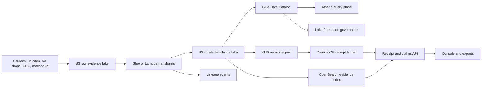

# System Overview

Ghost Ark v50 is organized into five operational planes:

This page describes the existing AWS evidence and receipt-control plane. For the newer local LLM enforcement-runtime slice and its remaining Bedrock gaps, see `docs/architecture/OVERVIEW.md`.

1. Ingest accepts raw evidence through S3 drops, API uploads, SQS fan-in, and CDC normalization.
2. Transform promotes raw records into curated, partitioned, schema-checked Parquet datasets.
3. Catalog and govern register datasets in Glue, expose Athena query paths, and enforce Lake Formation controls.
4. Attest canonicalizes receipt payloads, hashes them, signs the digest through AWS KMS asymmetric keys, and records state in DynamoDB ledgers.
5. Present exposes APIs, OpenSearch-backed search, observatory dashboards, and evidence-pack exports.

The architecture intentionally separates empirical claims from cryptographic attestations. A signature proves that Ghost Ark observed and signed a canonical payload under a specific key and policy context. It does not prove the world described by the payload is true.

## Trust Boundaries

- Raw evidence is immutable by convention and lifecycle policy, but source systems can still be mutable.
- Terraform-managed evidence buckets enable S3 versioning across raw, curated, export, and Athena result zones.
- Curated datasets are reproducible transform outputs, partitioned by tenant and ingest date.
- Receipts bind evidence references, transform metadata, policy context, claim references, and lineage pointers.
- Lake Formation governs analytical disclosure; IAM governs service and resource access, including domain-scoped OpenSearch HTTP permissions.
- Tenant isolation relies on principal tags, explicit region lockouts, and centrally owned service roles.
- API Gateway authorizer context carries the tenant identity into receipt handlers before tenant access checks run.
- Observatory alarms publish to the observatory SNS topic for Lambda errors and Ghost Ark custom receipt-gap metrics.
