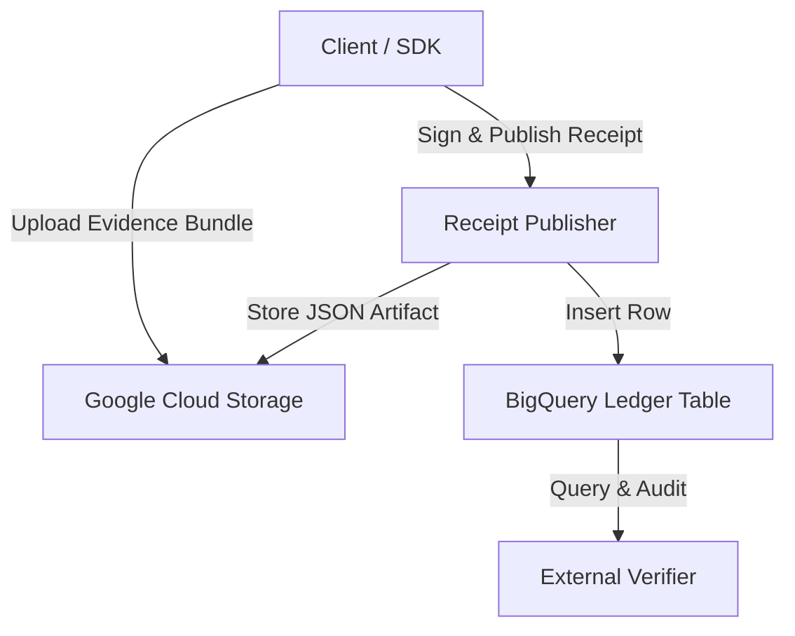

# Ghost-Ark Google Cloud Architecture

Ghost-Ark provides bounded governance receipt storage, deterministic hash-indexed evidence bundles, and transparent audit logs across Google Cloud Storage (GCS) and BigQuery.

## Overview

## System Components

1. **`@ghost-ark/google-cloud` Package**: TypeScript client SDK wrapping Cloud Storage and BigQuery APIs.
2. **Cloud Storage (GCS)**: Stores raw evidence payloads, canonical receipt JSON files, and signed Merkle checkpoints.
3. **BigQuery Transparency Ledger**: Stores structured receipt records indexed by `receipt_id`, `tenant_slug`, and `issued_at` for high-throughput SQL query auditing.
4. **TLA+ Specifications**: Formally proves exactly-once publication and monotonicity invariants under asynchronous retries (`proofs/cloud/`).
