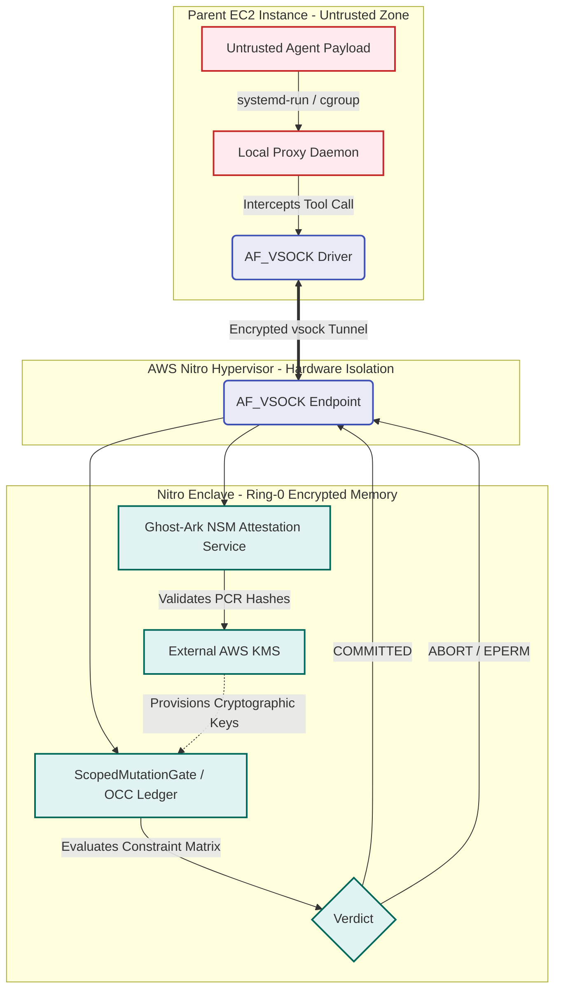

# Nitro Enclave Isolation Architecture

This document details the transition blueprint for Ghost-Ark's runtime isolation, migrating from native Linux Virtual File System (VFS) and namespaces (cgroups) into hardware-enforced AWS Nitro Enclaves. This architectural upgrade guarantees absolute execution blinding and physical memory encryption, physically precluding any compromised host OS kernel from tampering with the OCC state ledger.

## 1. The Architectural Boundary Shift

Currently, Ghost-Ark relies on `cgroup v2` limits and strict POSIX file permissions (`0600`) on a local UNIX domain socket (`/run/ghost-ark/ebpf-ledger.sock`) to securely identify agents and isolate the `ScopedMutationGate` IPC traffic.

Under the AWS Nitro architecture, the primary EC2 instance acts only as an untrusted forwarder. The `ScopedMutationGate` and the core cryptographic ledger are migrated entirely into an isolated Nitro Enclave virtual machine.

### The AF_VSOCK Bridge
Nitro Enclaves have **no persistent storage, no interactive access, and no external networking**. The *only* communication vector between the parent EC2 instance (where the non-deterministic agent payloads execute) and the isolated Enclave (where Ghost-Ark evaluates boundaries) is the virtual socket (`AF_VSOCK`).

Ghost-Ark's `AgentExecRequest` payloads will be multiplexed over an `AF_VSOCK` connection. A proxy daemon on the parent EC2 instance intercepts local agent requests and streams them over the vsock channel to the Enclave.

## 2. Cryptographic Attestation via NSM

To guarantee the Enclave has not been replaced with a malicious stub, Ghost-Ark leverages the Nitro Security Module (NSM). 

1. Upon boot, the Enclave generates an RSA/ECC keypair inside its encrypted memory.
2. The Enclave requests an **Attestation Document** from the underlying Nitro Hypervisor.
3. The Hypervisor physically signs the document, which includes the cryptographic hashes (Platform Configuration Registers - PCRs) of the Enclave's exact boot image (the compiled Rust/C++ Ghost-Ark Daemon), along with the Enclave's public key.
4. The parent EC2 instance routes this Attestation Document to **AWS KMS**.
5. AWS KMS cryptographically verifies the hypervisor signature and the PCR measurements. If the Ghost-Ark daemon is un-tampered, KMS provisions the decryption keys required to manage the OCC ledger back over the `AF_VSOCK` encrypted tunnel.

Any tampering with the Ghost-Ark binary on disk changes the PCR hash, causing AWS KMS to instantly sever cryptographic access.

## 3. Hardware-Blinded Agent Isolation (Mermaid Schematic)

The following schematic demonstrates the physical isolation boundary. A hijacked agent executing on the parent EC2 instance is fundamentally blinded from manipulating the OCC ledger, as it exists in physically partitioned, encrypted memory inaccessible even to `root` (EUID 0) on the parent instance.

