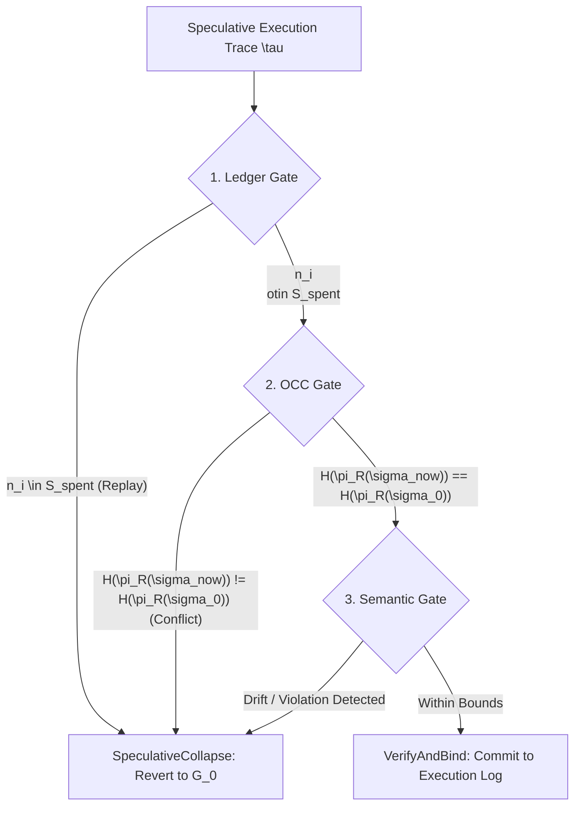

# Agentic Execution as Software Transactional Memory (STM)
## Mapping Database Isolation Levels to Stochastic LLM Processes

This document formally models the Ghost-Ark framework not as an applied perimeter defense, but as a structural Software Transactional Memory (STM) primitive designed to bound non-deterministic (stochastic) compute sequences. By framing LLM context windows and tool-calling trajectories as discrete state-transitions over an isolated environment, we map traditional RDBMS isolation levels directly to AI agent architectures.

---

### 1. Read Uncommitted (The Dirty Write Anomaly)
**The Paradigm:** Standard API-coupled agent pipelines (e.g., typical LangChain or AutoGPT implementations).
**The Mechanism:** The agent evaluates a step and mutates external state instantaneously without a validation or commit phase. 
**The Anomaly:** If an agent hallucinates midway through a planned execution trajectory $\tau = \langle a_1, a_2, \dots a_n \rangle$, the preceding actions ($a_1, a_2$) have already leaked dirty state into the environment. There is no cryptographic capability to issue a rollback, leaving downstream systems in an unrecoverable, partially mutated state.

### 2. Read Committed (The Phantom Read / Write Skew Anomaly)
**The Paradigm:** Traditional Sandboxing (e.g., NemoClaw isolated execution).
**The Mechanism:** The agent's state-fork executes within a bounded sandbox (Firecracker/CRIU). It can read environmental data, but its intent to write is buffered in an `intent_pool`. 
**The Anomaly:** While the sandbox prevents immediate dirty writes, it does not prevent the agent from constructing a logically invalid chain of thought based on stale data. If the external world state $\sigma$ changes during the agent's prolonged reasoning phase, the eventual flush of the `intent_pool` applies stale reasoning to a shifted reality, inducing Write Skew or Phantom Read anomalies.

### 3. Serializable (Optimistic Concurrency Control for Non-Deterministic Compute)
**The Paradigm:** Ghost-Ark DAB Tier-0 (Declarative Action Binding).
**The Mechanism:** The framework implements Optimistic Concurrency Control (OCC) over the agentic sequence. The execution trace $\tau$ is isolated in a ghost replica $G(\sigma_0)$. The `VerifyAndBind` operation acts as the two-phase commit (2PC) validation phase.

---

### 4. Formalizing `SpeculativeCollapse` and Resolving the Starvation Trap

To verify Serializability without inducing starvation, the Gateway Reference Monitor must avoid global state checks. If we validate the entirety of $\sigma_{now}$ against $\sigma_0$, any concurrent environmental change (e.g., an unrelated system log or background write) will result in a mismatch, leading to perpetual transaction aborts—**The Starvation Trap**.

#### The Read-Set Projection Operator ($\pi_R$)
To preserve liveness while enforcing safety, we define a projection operator $\pi_R$ that filters the global environment state $\sigma$ down to the exact data dependencies (the Read-Set) queried by the agent during the speculative trajectory $\tau$.

Let $\mathcal{L}_{nonce}$ represent the active `DAB_NonceLedger` and $S_{spent}$ represent the set of tombstoned nonces.
Let $\sigma_t$ represent the state of the external environment at time $t$.

An agent submits a speculative trace of intended tool calls $\tau_{intent} = \langle a_1, \dots, a_k \rangle$ generated against the projected starting state $\pi_R(\sigma_0)$.

**The Validation Phase (`VerifyAndBind`)**
Before any action $a_i \in \tau_{intent}$ is appended to the `execution_buffer`, the Gateway validates the transaction using two gates:

1. **The Ledger Gate (Replay & Liveness):**
   $$ n_i \notin S_{spent} \quad \text{and} \quad n_i \notin \mathcal{L}_{nonce} $$
2. **The OCC Gate (Read-Set State Equivalence):**
   $$ \mathcal{H}(\pi_R(\sigma_{now})) == \mathcal{H}(\pi_R(\sigma_0)) $$

**The Abort Condition (`SpeculativeCollapse`)**
If validation fails at either gate, the speculative state collapses:

$$
\text{SpeculativeCollapse}(\tau_{intent}) = 
\begin{cases} 
\text{Revert to } G(\sigma_0) & \text{if } \exists a_i \in \tau_{intent} : (n_i \in S_{spent} \lor \mathcal{H}(\pi_R(\sigma_{now})) \neq \mathcal{H}(\pi_R(\sigma_0))) \\
\text{Commit to } \mathcal{L}_{nonce} & \text{otherwise}
\end{cases}
$$

---

### 5. Track 3: The Semantic Control Plane & Cumulative Drift Bounds

Standard security systems evaluate tool calls individually. However, this fails to prevent **semantic drift** across a multi-turn trajectory. If an agent executes a sequence $\tau = \langle a_1, a_2, a_3 \rangle$, a policy violation might not be visible in $a_3$ alone, but rather in the cumulative transaction context.

#### Fréchet-Hoeffding Bounds for Trajectory Failure
We model the cumulative failure probability of the trajectory. Let $F_i$ represent the event that action $a_i$ introduces a semantic policy violation. The joint probability of overall trajectory failure $\mathbb{P}(F)$ is bounded by the Fréchet-Hoeffding bounds:

$$ \max\left(0, \sum_{i=1}^k \mathbb{P}(F_i) - (k - 1)\right) \le \mathbb{P}(F) \le \min_{i=1}^k \mathbb{P}(F_i) $$

For the union of failures (any single step violating semantic compliance):

$$ \max_{i=1}^k \mathbb{P}(F_i) \le \mathbb{P}(F_{\text{any}}) \le \min\left(1, \sum_{i=1}^k \mathbb{P}(F_i)\right) $$

Instead of assuming independent execution errors, Ghost-Ark's Semantic Gate calculates these dependent bounds to intercept cascading hallucinations in the ghost replica before they write to the physical environment.

#### Validation Pipeline Architecture

By passing through all three verification gates, the transaction verifies both low-level cryptographic freshness and high-level semantic alignment prior to execution.
